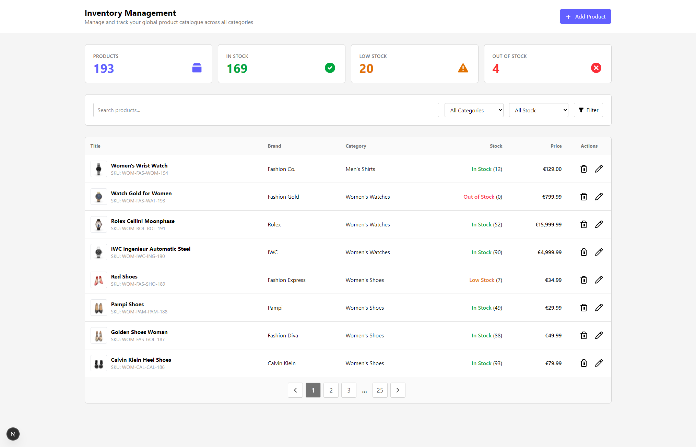

# WebShop – Del 1: Admin

Ett admin-gränssnitt för en webshop där produkter kan överblickas och hanteras. Projektet är byggt som en del av kursmomentet i agila metoder och fokuserar på samarbete, planering och ett fungerande arbetsflöde i Scrum.

## 📝 Om projektet

Applikationen är ett adminverktyg för att hantera en webshops produktkatalog. Gränssnittet visar en översikt över produkter och deras lagerstatus samt en paginerad produktlista.

Projektet är byggt i **Next.js** och hämtar produktdata från ett lokalt API som körs med **JSON Server**. Datan bygger på produkter från [DummyJSON](https://dummyjson.com/docs/products), men har anpassats efter projektets behov.

## 📝 Uppdraget

Målet är att bygga admin-sidorna för en webshop utifrån den tillhandahållna skissen. Applikationen ska hämta produktdata från ett API och på sikt erbjuda CRUD-funktionalitet för produkterna.

### Tekniska krav

1. **Arkitektur:** Server Components används för datahämtning och Client Components för interaktivitet.
2. **Forms:** Formulär används för filter och för att skapa eller redigera data mot API:et.
3. **Data:** Produkter ska kunna läsas, skapas, uppdateras och raderas via API:et.
4. **URL State Management:** Sökning, filtrering och sortering ska hanteras via `searchParams`.

## ✨ Nuvarande funktionalitet

- [x] Hämta produktdata från det lokala JSON Server-API:et
- [x] Visa en översikt över det totala antalet produkter
- [x] Visa en översikt över produkter i lager, med lågt lager och slut i lager
- [x] Visa produktbild, SKU, varumärke, kategori, lagerstatus och pris i produktlistan
- [x] Paginera produktlistan
- [x] Använda Server Components för datahämtning
- [x] Använda Client Components för tabell- och pagineringsinteraktioner
- [x] Generera ID, SKU och metadata när en produkt skapas via middleware
- [ ] Koppla sökning till produkt-API:et
- [ ] Koppla kategorifilter till produkt-API:et
- [ ] Koppla lagerstatusfilter till produkt-API:et
- [ ] Hantera sökning, filtrering och sortering via `searchParams`
- [ ] Skapa nya produkter via ett formulär
- [ ] Redigera befintliga produkter via ett formulär
- [ ] Radera produkter
- [ ] Slutföra CRUD-funktionaliteten för produkter

Filterformuläret finns i gränssnittet, men är ännu inte kopplat till produktlistans API-anrop. CRUD-funktionaliteten är därför markerad som pågående utveckling ovan.

## 🛠️ Teknik

- [Next.js](https://nextjs.org/) 16
- [React](https://react.dev/) 19
- [TypeScript](https://www.typescriptlang.org/)
- [JSON Server](https://github.com/typicode/json-server/tree/v0.17.4)
- [Lucide React](https://lucide.dev/) för ikoner
- CSS och Tailwind CSS-konfiguration

### Arkitektur

Projektet använder Server Components för datahämtning och Client Components för interaktivitet. Produktdata hämtas i `app/page.tsx` via `app/lib/products.ts`, medan exempelvis tabellen och pagineringen använder Client Components för interaktioner i webbläsaren.

## 🚀 Kom igång

### Förkunskaper

Du behöver ha följande installerat:

- [Node.js](https://nodejs.org/) – rekommenderad version 20 eller senare
- npm

### Starta projektet

Starta både Next.js-applikationen och JSON Server med:

```bash
npm run dev:full
```

Öppna sedan [http://localhost:3000](http://localhost:3000) i webbläsaren.

Det lokala API:et körs på [http://localhost:4000](http://localhost:4000). Produktdata finns på:

```text
http://localhost:4000/products
```

Du kan även starta tjänsterna separat:

```bash
npm run dev          # Startar Next.js
npm run mock-server  # Startar JSON Server
```

## 📁 Projektstruktur

```text
app/
├── components/              # Återanvändbara UI-komponenter
├── lib/products.ts          # Hämtning av produktdata från API:et
├── page.tsx                 # Applikationens huvudsida
├── layout.tsx               # Gemensam layout och sidhuvud
├── types.ts                 # TypeScript-typer för produkter och kategorier
└── globals.css              # Globala stilar

server/
├── products.json            # Mockdata för produkter och kategorier
└── middleware.js            # Pagination, validering och SKU-generering
```

## 🔄 Arbetsprocessen

Projektet genomförs med ett agilt arbetssätt baserat på Scrum.

- **GitHub Projects:** Uppgifter planeras, delas upp och följs upp i projektets board.
- **Branching:** Funktionalitet utvecklas i feature-branches och mergas inte direkt till `main`.
- **Commits:** Commit-meddelanden ska vara tydliga och beskriva förändringen.
- **Pull Requests:** Färdiga uppgifter lämnas in som Pull Requests.
- **Code Reviews:** Varje Pull Request ska granskas och godkännas av minst en annan gruppmedlem före merge.

## 📅 Tidslinje

- **Kursvecka 13:** Planering, setup och den första kodbasen. Listsidan skapades utan färdig filtrering, sökning och paginering.
- **Kursvecka 15:** Klientkomponenter och URL State Management används för sökning, filter och eventuell paginering.
- **Kursvecka 16:** CRUD-funktionalitet och formulär i Next.js färdigställs inför slutdemo.

## 👩‍💻 Gruppmedlemmar

- Georgij Li
- Leo Leksell
- Mervin Bratic
- Wilmer Kindstedt

## 🏞️ Skiss



## 📚 Relaterade länkar

- [Projektets GitHub-repository](https://github.com/Lexicon-Utbildning-Front-end-2026/Webshop-admin)
- [Startkod](https://github.com/Lexicon-Utbildning-Front-end-2026/projekt-agila-metoder-startkod)
- [DummyJSON Products API](https://dummyjson.com/docs/products)
